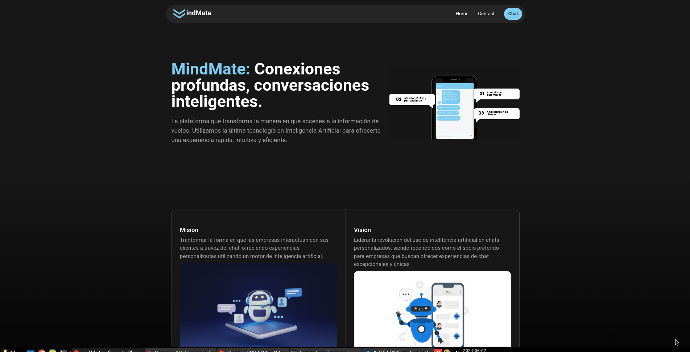

<div align="center">
      
    <h1>(MindMate) Chat asistente para aerolíneas
</h1>
</div>

## Deploy
### [1]: https://chatmindmate.netlify.app
## Preview  
<div align="center">
    
    
</div>

## Tecnologías

Este proyecto utiliza las siguientes tecnologías:

- React
- Tailwind CSS
- React-simple-chatbot

## Cómo levantar el proyecto

1. Clona el repositorio.

```bash
git clone https://github.com/Duberly2004/MindMate.git
```

```bash
cd MindMate
```

2. Instala las dependencias con `npm install`.

```bash
npm install
```

3. Ejecuta el comando `npm run dev` para iniciar el servidor de desarrollo.

```bash
npm run dev
```

4. Abre tu navegador y visita `http://localhost:5173`.

¡Listo! Ahora puedes comenzar a trabajar.